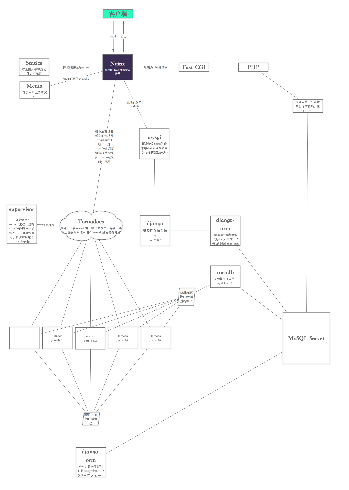

# Gyrfalcon使用方法


#### 系统环境

```
Mac OSX 10.10， Linux
```


#### 简单介绍

    Gyrfalcon是一个利用nginx转发操作系统中部署的基于python-tornado框架和
    python-django框架。
    其中的原理是在操作系统中开启4个tornado服务的端口，1个django服务的端口。
    4个tornado服务的端口是使用python开启tornado4个端口的服务，
    使用supervisor去管理这4个进程。
    1个django服务是django部署在python的uwsgi环境中，而nginx为uwsgi进行转发。
演示图如下



#### 目录说明

    以下的目录都不是绝对路径，而是相对于项目路径Gyrfalcon/Code/Gyrfalcon目录下

```

0.0 根目录 
- Gyrfalcon: 项目根路径，包含整个项目所有开发所需要的路径。
- Gyrfalcon.sublime-project: SublimeText3 项目文件 

1.0 项目主目录
- Gyrfalcon: 项目根路径，包含整个项目所有开发所需要的路径。
-- engine: 服务启动引擎，启动和配置整个项目和后台 
-- Gyrfalcon: 业务主目录
-- media: 资源文件，所有上传的资源和文件存放目录
-- service: 服务，服务器配置与启动
-- static: 静态文件
-- template: 模板，前端模板
-- workspace: 工作区，日志与测试

2.0 服务启动引擎
- engine: 服务启动引擎，启动和配置整个项目和后台
-- platforms: 不同平台兼容脚本
-- tools: 引擎辅助脚本
-- GyrfalconInitial.command: 初始化环境
-- GyrfalconRestart.command: 重启服务
-- GyrfalconShell.command: 服务对话shell与辅助功能
-- GyrfalconStart.command: 开启服务
-- GyrfalconStop.command: 关闭服务，

2.1 业务主目录
- Gyrfalcon: 业务主目录

-- configure: 全局配置，python脚本
--- GlobalConfigure.py: 全局通用配置
--- Results.py: 接口返回结果配置
--- Urls.py: Tornado前台的Url配置

-- main: 后台与前台代码
--- backend: 后台django源码
---- backend: 后台django的配置
---- manage.py: 后台django的服务
---- Account: 后台用户模块目录，注意，git提交的时候 在Account/migrations的目录中，除了__init__.py和0001_initial.py 其他最好忽略，尽量不与同伴混乱
--- site: 前台tornado源码

-- tools: 全局通用工具或库

2.2 资源文件
- media: 资源文件，所有上传的资源和文件存放目录

2.3 服务
- service: 服务，服务器配置与启动
-- configure: 服务配置文件，python脚本
-- profile: 服务器配置文件，对应各个服务的配置文件

--- nginx: nginx配置文件
---- log: nginx日志

--- supervidor: supervidor服务配置文件, 自动生成
--- uwsgi: uwsgi服务配置文件, 自动生成

- Services.py: 服务启动脚本, python脚本

2.4 静态文件
- static: 静态文件
-- admin: django后台静态文件

2.5 模板，前端模板
- template: 模板，前端模板

2.6 workspace: 工作区，日志与测试
- workspace: 工作区，日志与测试
-- log: 日志目录
--- django: django日志
--- supervidor: tornado日志


#### 初始化环境

     双击 或者 shell运行 engine/GyrfalconInitial.command


#### 运行服务

    双击 或者 shell运行 engine/GyrfalconRestart.command

    测试模式下：
        默认可以访问: http://localhost:8984    和    http://localhost:8981/admin

    正式模式下：
        默认可以访问: http://localhost    和    http://localhost/admin

#### 部署目的

    使用这样的部署目的是利用django框架对于admin开发的友好以及在django中建立数据模型的方便性上，
    我们使用django进行对网站后台的开发，并且由于后台的用户量大大少于前台的服务。所以，正是因为这一点，
    前台主要利用tornado进行开发，由于未来的许多项目可能出现BS和CS架构，利用tornado高并发以及对接口开
    发的友好程度。在前台以及整个Gyrfalcon主要利用tornado去操作。

#### URL说明:

    一些基本的url配置是在nginx的配置是固定的

    当URL的根目录下第一个目录是admin，那么就会访问django服务，类似http://domain.com/admin/
    和http://domain.com/admin/login，
    当URL的根目录下第一个目录是static，那么就会访问Gyrfalcon/static中的文件
    当URL的根目录下第一个目录是media，那么就会访问Gyrfalcon/media中的文件
    当URL中以.php为结尾，就会访问php的服务
    其他情况下默认访问tornado提供的服务

#### 如何开发

    在Gyrfalcon/main/site目录中创建一个新的脚本（如：GFIndexReqHandlers.py）并且新建一个类
    (GFIndexReqHandler继承Gyrfalcon/main/site/Common的GFReqHandlers模块中的GFReqHandler)，
    在Gyrfalcon/configure/Urls.py中的urlList按照格式加入一个你需要新建的url，
    并且跟之前建立的GFIndexReqHandler类关联，然后就可以根据路径去访问你建立的接口了。

#### 代码调试

    # v1.0新增

    双击engine/GyrfalconShell.command文件，将会打开一个python-shell
    对话框，该对话框中已经加载了项目环境配置，另外如果需要帮助请用命令行添加脚本参数:
    engine/GyrfalconShell.command help
    将会出现其他命令帮助，
    其中一个例子：
    engine//GyrfalconShell.command createsuperuser
    就是为后台创建一个新用户

    注：该对话框环境主要是后台和数据库相关工具。开发中主要利用它来进行对数据的操作以及实时调试写好的代码。
